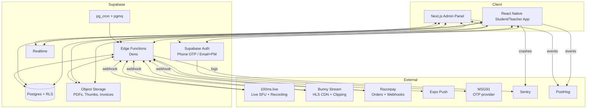

# Backend Architecture

This is the decision record and system design for the Coaching OS backend. It supersedes any less specific note elsewhere.

## 1. Constraints driving the design

- Small team, ideally 1–2 engineers building the MVP.
- India-first market; costs in INR matter.
- Relational data (batches, enrollments, memberships, payments) with strict multi-role access.
- Mix of synchronous reads, realtime push (live class status, attendance), and large media (recordings).
- Owner is non-technical but must be able to self-serve via admin panel.
- Demo-driven schedule; time-to-first-demo matters more than theoretical scale.
- Must scale from hundreds to ~20k active students without rewrite.

## 2. Backend options considered

| Option | Summary | Why rejected / accepted |
|---|---|---|
| **Supabase Cloud** | Postgres + Auth + Storage + Realtime + Edge Functions + Row-Level Security | ✅ **Chosen.** Best leverage per engineer-hour; standard Postgres; RLS encodes our multi-role model as data. |
| Firebase | Firestore + Auth + Storage + Functions | ❌ Firestore forces denormalization; modeling batches, enrollments, memberships is painful. Pricing surprises at scale. Lock-in. |
| Node + NestJS + Postgres on VPS | Full control stack | ❌ 2–4 weeks of plumbing we'd never recoup. Every feature is "build and own it." |
| Appwrite | Open-source BaaS | ⚠️ Interesting, but smaller ecosystem; Postgres flavor less mature than Supabase's. |
| Hasura + Postgres | GraphQL auto-API | ⚠️ Good, but GraphQL overkill for our shapes; Supabase Realtime + PostgREST already cover 90%. |
| AWS (Cognito + RDS + Lambda + S3 + SNS) | Enterprise stack | ❌ Ops burden is real; IAM + VPC + CDK just to start. No payoff at MVP. |

### Live video layer
- **100ms.live** chosen for MVP (see Phase 4).
- LiveKit Cloud as migration target.
- Agora, Jitsi, Twilio Video considered and rejected in Phase 4 rationale.

### Media CDN
- **Bunny Stream** chosen for recordings + clips.
- Alternatives: Mux (more expensive), Cloudflare Stream (good but pricier per GB + fewer India POPs), SHAKA on S3 + CloudFront (too much ops).

### Payments
- **Razorpay** (Phase 6).

### Push
- **Expo Push** in front of FCM/APNs (Phase 8).

## 3. Final architecture (high level)



## 4. Why this architecture

1. **Postgres is the spine.** Every write ends up in Postgres; webhooks from third parties are just ways to update Postgres. That means audit, reporting, and migrations are all trivial SQL.
2. **RLS is the access-control substrate.** Students/teachers/admins hit the same tables; the database itself gates who sees what. No middleware layer to desync.
3. **Edge Functions for anything non-trivial.** Signing tokens, verifying webhooks, calling external APIs — server-side Deno in the same platform.
4. **Third-party services where they beat us.** Live video, HLS CDN, payments, push — we integrate, not build.
5. **pg_cron for scheduling.** No separate worker. Functions are idempotent.
6. **Realtime is free.** Supabase Realtime broadcasts Postgres CDC; perfect for live class status, attendance updates, membership changes.

## 5. Authentication strategy

### Phone OTP (primary for students)
- Supabase Auth phone provider → MSG91.
- One-tap resend, 30s cooldown.
- Maximum 5 OTP attempts per hour per phone.
- `profiles` table joined via trigger when `auth.users` row inserted.

### Email + password (admin + teacher)
- Admins create teacher accounts with auto-generated initial password sent via email; teacher resets on first login.
- Strong password policy (zxcvbn score ≥3).

### Sessions
- JWT stored in `expo-secure-store` on mobile, HttpOnly cookie on web (Next.js `@supabase/ssr`).
- Refresh tokens rotated.

### MFA (future)
- Admin TOTP via Supabase MFA — defer to post-launch unless client insists.

## 6. Role-based access control

### Roles (stored on `profiles.role`)
- `student`
- `teacher`
- `admin`

### Enforcement layers
1. **DB RLS policies** — primary.
2. **Edge Function role checks** — secondary, for external-service calls.
3. **Client UI gating** — tertiary, for UX only.

### Helper functions
```sql
create function is_admin() returns boolean
  language sql stable security definer as $$
    select exists(select 1 from profiles where id = auth.uid() and role = 'admin');
  $$;

create function is_teacher() returns boolean ...
create function is_student() returns boolean ...
create function is_teacher_of(batch_id uuid) returns boolean ...
create function has_active_membership(uid uuid) returns boolean ...
```

These are called from RLS policies for readability and from Edge Functions via RPC.

### Pattern: SELECT policies per table
Every table has explicit SELECT/INSERT/UPDATE/DELETE policies. No "deny by default with no rules." Examples in `DATABASE-SCHEMA-AND-STORAGE-PLAN.md`.

## 7. Domain design

### 7.1 User & Identity
- `auth.users` (managed by Supabase).
- `profiles` (app-level). Trigger on `auth.users` insert.
- `device_tokens` (per user, per device).

### 7.2 Academic
- `courses`: the institute's subjects/programs.
- `batches`: a cohort of students tied to a course.
- `enrollments`: (student_id, batch_id, status).
- Teachers assigned to batches via `batch_teachers` many-to-many.

### 7.3 Classes
- `classes`: scheduled units; type `live | recorded | hybrid`.
- `class_rooms`: provider metadata (100ms room id, recording status).
- `live_participants`: join/leave history.

### 7.4 Attendance
- `attendance` (student_id, class_id, method, scanner_id, class_window_ok).
- `qr_secrets`, `qr_jti_cache` for the QR subsystem.

### 7.5 Content
- `content_items`: polymorphic row for pdf/image/doc/recording/clip/link.
- `watch_positions`.

### 7.6 Payments
- `plans`, `memberships`, `payments`.

### 7.7 Notifications
- `notifications` (queue + history), `notification_preferences`, `device_tokens`.

### 7.8 Ops
- `audit_log`: admin writes.
- `announcements`.

Full tables and columns in `DATABASE-SCHEMA-AND-STORAGE-PLAN.md`.

## 8. Live video architecture

### MVP (Phase 4)
- 100ms.live SFU hosted.
- Teacher app role `host`, students `subscriber`.
- Cloud recording enabled; recording bucket = Supabase Storage `class-recordings-raw`.
- Edge Function `create-100ms-room` creates rooms idempotently.
- Edge Function `issue-100ms-token` mints client tokens after RLS-checked enrollment + membership.
- Edge Function `recording-webhook` handles `beam.recording.success`.

### Recording pipeline
```mermaid
sequenceDiagram
    participant Teacher
    participant RN as Teacher App
    participant EF as Edge Fn
    participant HMS as 100ms
    participant Bunny
    participant PG as Postgres

    Teacher->>RN: tap "Start Class"
    RN->>EF: create-100ms-room + issue token
    EF->>HMS: create room (if not exists)
    EF->>PG: class_rooms.recording_status='recording'
    EF-->>RN: room token
    RN->>HMS: join as host; recording starts automatically

    Note over HMS: Class runs

    Teacher->>RN: end class
    RN->>EF: finalize-class
    EF->>HMS: endRoom
    HMS-->>EF: beam.recording.success webhook
    EF->>HMS: fetch recording URL
    EF->>Bunny: POST /library/upload (server-side pull)
    Bunny-->>EF: video_id
    EF->>PG: insert content_items(type='recording', video_asset_id)
    EF->>PG: class_rooms.recording_status='ready'
    EF->>PG: insert notifications for enrolled students
```

### Playback pipeline
- Client requests `sign-bunny-url(content_id)`.
- Edge Function checks visibility + membership + enrollment.
- Returns Bunny token-authed URL with 1-hour TTL.
- Client renders in `react-native-video` (HLS).

### Clip pipeline
- Teacher selects start/end.
- Edge Function `create-clip` calls Bunny Stream Clipping API.
- Bunny emits `video.ready` webhook → Edge Function creates new `content_items`.

### Future scale path
- If 100ms costs become heavy, move to self-hosted LiveKit on a Hetzner GPU-less server (Bangalore) + MediaMTX for RTMP fallback.
- Add a TURN server only if STUN coverage proves insufficient.

## 9. Storage architecture

| Asset | Where | Why |
|---|---|---|
| PDFs, docs | Supabase Storage `materials/` | RLS + signed URLs + cheap |
| Images | Supabase Storage `images/` | Same |
| Thumbnails | Supabase Storage `thumbs/` (public, cache-optimized) | Cheap + no signing overhead |
| Invoices | Supabase Storage `invoices/` (private) | Private per user |
| Raw class recordings | Supabase Storage `class-recordings-raw/` | Temporary; deleted 30 days after transcode |
| Transcoded HLS videos | Bunny Stream | Purpose-built CDN; cheaper per-GB delivery |
| Clips | Bunny Stream | Same |

### Retention
- Materials: keep until admin deletes; soft-delete 30 days.
- Recordings: 2 years default; admin can archive to Bunny cold storage (cheaper) after 6 months.
- Raw recordings: 30 days after transcode success; auto-purged by pg_cron.
- Audit log: 7 years.
- Device tokens: prune inactive (>90 days `last_seen_at`).

## 10. Membership and payment flow

See `PHASE-06`. In short:
1. Razorpay order via Edge Function.
2. RN SDK checkout.
3. Client verify + server webhook (either path is idempotent).
4. Membership transactionally extended.
5. Notifications enqueued.

## 11. Notifications pipeline

See Phase 8. Single queue (`notifications` table) + Edge Function fanout. pg_cron drives scheduled categories.

## 12. Background jobs

### pg_cron schedule (examples)
```sql
select cron.schedule('class-reminders', '* * * * *',
  $$ select net.http_post(... Edge Fn class-reminders ...) $$);
select cron.schedule('expiry-enforcement', '0 2 * * *',
  $$ select net.http_post(... enforce-expiry ...) $$);
select cron.schedule('qr-jti-cleanup', '*/5 * * * *',
  $$ delete from qr_jti_cache where consumed_at < now() - interval '15 minutes' $$);
select cron.schedule('recording-pipeline-health', '*/10 * * * *',
  $$ select net.http_post(... health-check-recordings ...) $$);
select cron.schedule('raw-recording-purge', '0 3 * * *',
  $$ select net.http_post(... purge-old-raw-recordings ...) $$);
```

### Queue (when we need retries with backoff)
- Supabase `pgmq` extension for retryable work (e.g., transcode retries, push fanout).

## 13. Audit logging

- `audit_log` rows written by triggers on admin-controlled tables (`plans`, `batches`, `classes` edits, etc.).
- Each row: actor_id, action, target_table, target_id, diff (JSONB), created_at.
- Admin panel `/admin/audit` lets the owner read history.

## 14. Scalability path

| Stage | Users | Moves |
|---|---|---|
| MVP | <500 students | Supabase Free / Pro. Single project. |
| Growth | 500–5k | Supabase Pro with bigger compute; enable read replicas for admin reports. Bunny on default plan. |
| Scale | 5k–20k | Move Edge Functions that touch video to dedicated region; pre-sign URLs in batch; migrate live to LiveKit Cloud if 100ms costs exceed ₹50k/mo. |
| Multi-institute | 20k+ | Multi-tenant reshape: add `institute_id` to every table; row isolation via RLS; consider per-institute Supabase projects for data sovereignty. |

No schema migration is required to reach the 5k–20k range; the Supabase plan change and a few indexes are enough.

## 15. Cost-awareness (approximate MVP monthly)

| Service | Estimate (INR) |
|---|---|
| Supabase Pro | ₹2,000 |
| 100ms.live (1 class × 30 students × 60 min × 20 days) | ~₹15,000 |
| Bunny Stream (500GB delivery + 100GB storage) | ~₹3,000 |
| Razorpay | 2% of collections |
| MSG91 OTP | ₹0.18/SMS × ~5,000 = ₹900 |
| Sentry | Free tier then ₹2,000 |
| PostHog | Free tier then ₹2,000 |
| Vercel admin panel | Free tier |
| **Total** (non-payment) | ~₹25,000/mo at small scale |

Client should budget for ~₹30–40k/mo at MVP with headroom.

## 16. Security design

### Hardening
- RLS on every public table (CI check).
- Service-role key only inside Edge Functions and server actions; never in mobile or admin client bundles.
- All Edge Functions validate JWT role before privileged operations.
- Rate limit sensitive endpoints (`consume-qr-token`, `create-razorpay-order`, `issue-100ms-token`) with a simple `rate_limits(key, window, count)` table + Edge Function check.
- Secrets in Supabase project secrets and EAS secrets; never committed.
- `.env.example` tracked; `.env` ignored.
- HTTPS everywhere; HSTS on admin domain.
- CSP on admin panel (Next.js middleware).

### Data protection
- All storage private by default; public buckets explicitly enabled only for thumbs with no PII.
- PII fields (phone, email) not logged to Sentry; use scrubbers.
- Signed URLs TTL <1h.

### Webhook security
- All webhooks verify HMAC signatures (Razorpay, 100ms, Bunny).
- Reject replays older than 5 min.

### Compliance
- Privacy policy, T&C.
- Data deletion endpoint for account closure (Phase 8+).
- If EU students ever → evaluate GDPR; not relevant to India market at MVP.

## 17. Failure scenarios and recovery

| Scenario | Impact | Recovery |
|---|---|---|
| Supabase region outage | Full outage | Supabase handles. We accept single-region MVP. Plan multi-region P2. |
| 100ms outage | No live classes | Fallback: admin posts "class delayed"; we record via teacher's laptop as emergency. |
| Bunny outage | No recorded playback | Signed URLs retried; accept degraded state; 30-day raw copy in Supabase lets us re-upload. |
| Razorpay outage | Payments stalled | Admin manual override marks memberships as paid; reconcile later. |
| Push outage | Reminders delayed | In-app inbox still shows them; no data loss. |
| Edge Function cold start | 1–2s latency | Keep-warm via cron; critical ones kept hot. |
| Storage quota hit | Uploads blocked | Auto-scale in Supabase Pro; alert at 80%. |
| Massive QR scan spike | Writes backlog | Queue at the Edge Function; scanner UI tolerates 2s latency. |
| Webhook duplicate | State corruption | Every webhook handler is idempotent (conflict checks + `if not paid` guards). |
| DB corruption | Data loss | Supabase PITR (7-day) + nightly logical backups to our own S3-compatible bucket. |

### Backups
- Supabase PITR enabled on Pro.
- Nightly `pg_dump` to a separate bucket as an independent safety net.
- Storage buckets: versioning on (where supported) for `materials/`.

## 18. Observability

- **Sentry** for errors + performance in RN, Next.js, Edge Functions. Release tags per OTA build.
- **Supabase logs + Log Drains to Logflare** for backend debugging.
- **PostHog** for product analytics.
- **Synthetic checks** — a cron-hit on a `/health` Edge Function returning DB + storage status.
- **Alerting** — Sentry → Slack `#alerts`. PostHog → weekly email. Pipeline health checks → PagerDuty-lite (email is enough at MVP).

## 19. API style

- **Supabase Postgrest for 80% of reads and simple writes.** Direct table access with RLS.
- **Edge Functions for operations that**
  - Mutate multiple rows atomically with business logic.
  - Call external APIs.
  - Need to mint tokens.
  - Need elevated privileges.
- **Postgres RPCs** (stored functions exposed via Postgrest) for operations that don't need external calls but have business logic (e.g., `register_device_token`).
- GraphQL: explicitly rejected. Postgrest + realtime covers our shapes; GraphQL adds complexity.

See `API-DESIGN-AND-SERVICE-BOUNDARIES.md` for the full list.

## 20. Provider abstraction (for future-proofing)

Each external integration is behind a thin interface in Edge Functions:
```
/lib/live/ILiveProvider.ts       (100ms today, LiveKit tomorrow)
/lib/video/IVideoCdn.ts          (Bunny today, Mux tomorrow)
/lib/payments/IPaymentProvider.ts (Razorpay today, Stripe tomorrow)
/lib/push/IPushProvider.ts       (Expo today, native FCM tomorrow)
```

Schema stores provider-agnostic ids (`video_asset_id`, `provider_room_id`, `provider: text`), so swapping a provider is an Edge Function change plus a migration, not a rewrite.
