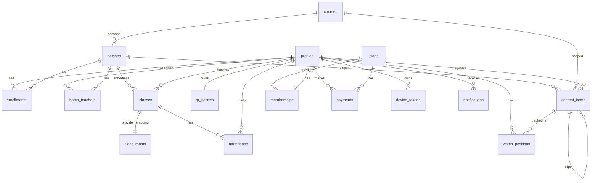

# Database Schema & Storage Plan

PostgreSQL hosted by Supabase. All tables live in the `public` schema unless noted. RLS on every table.

## 1. Naming conventions

- snake_case everywhere.
- Primary keys: `id uuid primary key default gen_random_uuid()`.
- Timestamps: `created_at`, `updated_at`, all `timestamptz`, default `now()`.
- Foreign keys: singular table name + `_id` (e.g., `batch_id`).
- Soft delete: `deleted_at timestamptz null` where applicable.

## 2. Enums

```sql
create type user_role as enum ('student','teacher','admin');
create type class_type as enum ('live','recorded','hybrid','offline');
create type class_status as enum ('scheduled','live','ended','canceled');
create type content_type as enum ('pdf','image','doc','link','recording','clip');
create type content_visibility as enum ('public','batch','course','enrolled_only','membership_only');
create type content_status as enum ('uploading','processing','ready','failed','deleted');
create type attendance_method as enum ('qr','manual','live');
create type membership_status as enum ('active','expired','canceled','pending');
create type payment_status as enum ('pending','paid','failed','refunded');
create type recording_status as enum ('not_started','recording','processing','ready','failed');
```

## 3. Core tables

### 3.1 `profiles`
Mirrors `auth.users` with app-level fields. Populated via trigger.

| Column | Type | Notes |
|---|---|---|
| id | uuid PK | = auth.users.id |
| full_name | text not null | |
| phone | text | unique where not null |
| email | text | unique where not null |
| role | user_role not null default 'student' | |
| batch_id | uuid FK `batches(id)` | students only |
| avatar_url | text | |
| is_active | boolean not null default true | |
| created_at | timestamptz not null default now() | |
| updated_at | timestamptz not null default now() | |

Trigger `handle_new_user()` on `auth.users` insert → inserts profiles row with `role='student'` (admin must promote teachers/admins).

### 3.2 `courses`
| Column | Type |
|---|---|
| id | uuid PK |
| name | text not null |
| subject | text |
| description | text |
| is_active | boolean default true |
| created_at | timestamptz |

### 3.3 `batches`
| Column | Type |
|---|---|
| id | uuid PK |
| course_id | uuid FK |
| name | text not null |
| year | int |
| start_date | date |
| end_date | date |
| is_active | boolean default true |

### 3.4 `enrollments`
Student ↔ batch link (a student might move between batches; we keep history).

| Column | Type |
|---|---|
| id | uuid PK |
| student_id | uuid FK profiles(id) |
| batch_id | uuid FK |
| status | text default 'active' (active, inactive, transferred) |
| enrolled_at | timestamptz |
| ended_at | timestamptz |

UNIQUE `(student_id, batch_id)` WHERE `status='active'`.

### 3.5 `batch_teachers`
| Column | Type |
|---|---|
| batch_id | uuid FK |
| teacher_id | uuid FK profiles(id) |
| subject | text |
| PRIMARY KEY | (batch_id, teacher_id, subject) |

### 3.6 `classes`
| Column | Type |
|---|---|
| id | uuid PK |
| batch_id | uuid FK |
| teacher_id | uuid FK profiles(id) |
| subject | text not null |
| title | text |
| scheduled_at | timestamptz not null |
| duration_min | int not null default 60 |
| type | class_type default 'live' |
| status | class_status default 'scheduled' |
| recording_asset_id | text (bunny video id) |
| notes | text |
| created_at | timestamptz |

### 3.7 `class_rooms`
| Column | Type |
|---|---|
| class_id | uuid PK FK classes(id) |
| provider | text default '100ms' |
| provider_room_id | text not null |
| recording_status | recording_status default 'not_started' |
| started_at | timestamptz |
| ended_at | timestamptz |
| recording_raw_url | text |
| recording_asset_id | text |

### 3.8 `live_participants`
| Column | Type |
|---|---|
| class_id | uuid FK |
| user_id | uuid FK |
| joined_at | timestamptz default now() |
| left_at | timestamptz |
| duration_seconds | int |
| PRIMARY KEY | (class_id, user_id, joined_at) |

### 3.9 `attendance`
| Column | Type |
|---|---|
| id | uuid PK |
| student_id | uuid FK |
| class_id | uuid FK |
| marked_at | timestamptz default now() |
| method | attendance_method |
| scanner_id | uuid FK profiles(id) (null for live/manual by admin) |
| class_window_ok | boolean default true |
| note | text |

UNIQUE `(student_id, class_id)`.

### 3.10 `qr_secrets`
Per-student HMAC secret for rotating QR tokens.

| Column | Type |
|---|---|
| student_id | uuid PK |
| secret | text not null |
| rotated_at | timestamptz default now() |

### 3.11 `qr_jti_cache`
Prevents replay. Purged every 5 min by pg_cron.

| Column | Type |
|---|---|
| jti | uuid PK |
| student_id | uuid |
| consumed_at | timestamptz default now() |

### 3.12 `content_items`
Polymorphic content.

| Column | Type |
|---|---|
| id | uuid PK |
| type | content_type not null |
| title | text not null |
| description | text |
| subject | text |
| batch_id | uuid FK (nullable for `public`) |
| course_id | uuid FK |
| storage_path | text (for supabase storage assets) |
| video_asset_id | text (for bunny stream assets) |
| thumbnail_path | text |
| parent_content_id | uuid FK self (clip → recording) |
| clip_in_seconds | int |
| clip_out_seconds | int |
| visibility | content_visibility default 'enrolled_only' |
| status | content_status default 'ready' |
| search_tsv | tsvector GENERATED ALWAYS AS (to_tsvector('simple', coalesce(title,'') \|\| ' ' \|\| coalesce(description,''))) STORED |
| created_by | uuid FK profiles(id) |
| approved_by | uuid FK profiles(id) |
| created_at | timestamptz |
| deleted_at | timestamptz |

Indexes:
- `(batch_id, type, created_at desc)` where `deleted_at is null`.
- `(course_id, type, created_at desc)` where `deleted_at is null`.
- GIN on `search_tsv`.

### 3.13 `watch_positions`
| Column | Type |
|---|---|
| user_id | uuid FK |
| content_id | uuid FK |
| seconds | int |
| updated_at | timestamptz |
| PRIMARY KEY | (user_id, content_id) |

### 3.14 `plans`
| Column | Type |
|---|---|
| id | uuid PK |
| code | text unique (e.g., `MONTHLY`) |
| name | text |
| duration_days | int |
| amount_inr | numeric(10,2) |
| features | jsonb default '{}' |
| is_active | boolean default true |

### 3.15 `memberships`
Exactly one row per student (upsert semantics).

| Column | Type |
|---|---|
| id | uuid PK |
| student_id | uuid unique FK |
| plan_id | uuid FK |
| starts_at | timestamptz |
| expires_at | timestamptz |
| status | membership_status default 'pending' |
| razorpay_subscription_id | text |
| created_at | timestamptz |
| updated_at | timestamptz |

Index on `(student_id, status)` and partial `status='active'`.

### 3.16 `payments`
| Column | Type |
|---|---|
| id | uuid PK |
| student_id | uuid FK |
| plan_id | uuid FK |
| amount_inr | numeric(10,2) |
| status | payment_status default 'pending' |
| razorpay_order_id | text |
| razorpay_payment_id | text |
| razorpay_signature | text |
| invoice_pdf_path | text |
| paid_at | timestamptz |
| created_at | timestamptz |

Indexes: `(student_id, paid_at desc)`, `(razorpay_order_id)`, `(razorpay_payment_id)`.

### 3.17 `device_tokens`
| Column | Type |
|---|---|
| id | uuid PK |
| user_id | uuid FK |
| platform | text (ios/android/web) |
| expo_token | text unique |
| last_seen_at | timestamptz |

### 3.18 `notifications`
Queue + history.

| Column | Type |
|---|---|
| id | uuid PK |
| user_id | uuid FK |
| category | text (e.g., `class.reminder.15m`) |
| title | text |
| body | text |
| payload | jsonb (routing info) |
| scheduled_for | timestamptz (nullable) |
| sent_at | timestamptz |
| read_at | timestamptz |
| expo_ticket_id | text |
| error_code | text |
| created_at | timestamptz default now() |

Indexes: `(user_id, read_at)` partial `read_at is null`; `(sent_at is null, scheduled_for)` partial.

### 3.19 `notification_preferences`
One row per user; all booleans default true.

### 3.20 `announcements`
| Column | Type |
|---|---|
| id | uuid PK |
| title | text |
| body_html | text |
| target_batch_id | uuid null |
| target_course_id | uuid null |
| target_audience | text (all/students/teachers) |
| image_url | text |
| scheduled_at | timestamptz |
| published_at | timestamptz |
| created_by | uuid FK |

### 3.21 `audit_log`
| Column | Type |
|---|---|
| id | bigserial PK |
| actor_id | uuid |
| action | text (insert/update/delete) |
| target_table | text |
| target_id | uuid |
| diff | jsonb |
| created_at | timestamptz |

## 4. Entity relationship diagram



## 5. Indexes (summary)

Explicit indexes beyond primary keys and simple FK indexes:

```sql
create index on classes (batch_id, scheduled_at);
create index on classes (status, scheduled_at) where status in ('scheduled','live');
create index on attendance (class_id);
create index on attendance (student_id, marked_at desc);
create index on content_items (batch_id, type, created_at desc) where deleted_at is null;
create index on content_items (course_id, type, created_at desc) where deleted_at is null;
create index on content_items using gin (search_tsv);
create index on memberships (student_id) where status = 'active';
create index on payments (student_id, paid_at desc);
create index on notifications (user_id, read_at) where read_at is null;
create index on notifications (scheduled_for) where sent_at is null;
create index on qr_jti_cache (consumed_at);
```

## 6. Helper functions

```sql
-- Role helpers
create function is_admin() returns boolean ...;
create function is_teacher() returns boolean ...;
create function is_teacher_of_batch(b uuid) returns boolean ...;
create function is_enrolled_in_batch(b uuid) returns boolean ...;

-- Business helpers
create function has_active_membership(uid uuid) returns boolean ...;

-- Content visibility
create function content_visible(c content_items, uid uuid) returns boolean ...;
```

## 7. RLS policies (representative)

### profiles
```sql
alter table profiles enable row level security;
create policy "profile self read" on profiles for select using (id = auth.uid());
create policy "profile admin read" on profiles for select using (is_admin());
create policy "profile teacher limited read" on profiles for select
  using (is_teacher() and exists (
    select 1 from enrollments e
    where e.student_id = profiles.id
      and is_teacher_of_batch(e.batch_id)
  ));
create policy "profile self update" on profiles for update using (id = auth.uid()) with check (id = auth.uid());
create policy "profile admin update" on profiles for update using (is_admin());
```

### classes
```sql
alter table classes enable row level security;
create policy "class admin all" on classes for all using (is_admin()) with check (is_admin());
create policy "class teacher own" on classes for all using (teacher_id = auth.uid()) with check (teacher_id = auth.uid());
create policy "class enrolled student read" on classes for select
  using (is_enrolled_in_batch(batch_id));
```

### attendance
```sql
alter table attendance enable row level security;
revoke insert on attendance from authenticated;                 -- only via Edge Function
create policy "att self read" on attendance for select using (student_id = auth.uid());
create policy "att teacher read" on attendance for select using (
  exists(select 1 from classes c where c.id = attendance.class_id and is_teacher_of_batch(c.batch_id))
);
create policy "att admin all" on attendance for all using (is_admin()) with check (is_admin());
```

### content_items
```sql
alter table content_items enable row level security;
create policy "content visibility read" on content_items for select
  using (deleted_at is null and content_visible(content_items, auth.uid()));
create policy "content teacher write own" on content_items for insert
  with check (created_by = auth.uid() and is_teacher());
create policy "content admin all" on content_items for all using (is_admin()) with check (is_admin());
```

### memberships / payments
```sql
-- Student can read own; admin reads all; writes go through Edge Functions (service role).
```

### qr_secrets / qr_jti_cache
```sql
-- No direct client reads except self.
create policy "qr self read" on qr_secrets for select using (student_id = auth.uid());
-- Everything else: service role only.
```

Full policy set lives in `supabase/migrations/0002_rls.sql`.

## 8. Storage plan

### Supabase Storage buckets
| Bucket | Visibility | Purpose |
|---|---|---|
| `avatars` | public read | Profile photos |
| `materials` | private | PDFs, docs, non-video files |
| `thumbs` | public read | Thumbnails for content_items |
| `invoices` | private | Generated invoice PDFs |
| `class-recordings-raw` | private | Temporary raw MP4 from 100ms before Bunny transcode |

### Storage policies (representative)
```sql
-- materials: only users with access to the content_item can download
create policy "materials read via Edge Fn only" on storage.objects
  for select using (false);  -- direct downloads disabled
-- All reads go through `request-material-url` which verifies and returns a short-lived signed URL.
```

### Bunny Stream libraries
- `recordings` library — class recordings.
- `clips` library — teacher-created clips.
- Both with token authentication enabled; playback URLs signed by Edge Functions.

## 9. Media lifecycle

### Recordings
1. 100ms writes MP4 to `class-recordings-raw/{class_id}.mp4`.
2. Edge Function uploads to Bunny `recordings` library.
3. On success: Bunny returns `video_id`; stored on `content_items.video_asset_id` and `class_rooms.recording_asset_id`.
4. After 30 days: pg_cron purges the raw MP4 from Supabase Storage.

### Clips
1. Teacher submits `(source_content_id, in, out)`.
2. Edge Function calls Bunny clipping API → creates new video.
3. New `content_items(type='clip', parent_content_id, video_asset_id)`.
4. Bunny webhook flips `status='ready'`.

### Materials
1. Client gets signed upload URL to `materials/{uuid}.{ext}`.
2. Client uploads directly to Supabase Storage.
3. Client calls `finalize-material` → inserts `content_items`.
4. If PDF, async thumbnail job renders page 1 → `thumbs/`.

## 10. Data retention policy

| Data | Retention |
|---|---|
| Attendance | Indefinite (business record) |
| Payments | Indefinite (finance record) |
| Memberships | Indefinite |
| Content (not deleted) | Indefinite |
| Content (soft-deleted) | Hard-deleted 30 days after `deleted_at` |
| Raw class recordings | 30 days post-transcode |
| Transcoded recordings | 2 years default; admin can archive earlier |
| QR JTI cache | 15 min |
| Notifications | 90 days after `sent_at` |
| Audit log | 7 years |
| Device tokens | Prune if `last_seen_at < now() - 90 days` |
| Auth sessions | Supabase default (1 week refresh) |

## 11. Backup & disaster recovery

- Supabase PITR (point-in-time recovery) enabled on Pro — 7-day window.
- Nightly logical backup (`pg_dump`) to our own S3-compatible bucket outside the Supabase account.
- Storage bucket versioning for `materials` and `invoices` (where Supabase supports it).
- Monthly DR drill: spin up a fresh Supabase project from backup, verify admin panel reads successfully.

## 12. Migrations strategy

- All schema changes as SQL files in `supabase/migrations/` (timestamped).
- CI runs `supabase db reset` against a local shadow DB on PR.
- Production migrations deployed via `supabase db push` after staging validation.
- Destructive changes (drop column, rename) go through a 2-step expand/contract over two releases.

## 13. Seed data (dev + staging)

`supabase/seed.sql` includes:
- 1 course (`JEE Physics`), 2 batches (`Batch-A-2026`, `Batch-B-2026`).
- 1 admin, 3 teachers, 10 students distributed in batches.
- 3 plans (monthly, quarterly, yearly).
- Active memberships for all students.
- 4 classes (2 past with recordings, 1 live now, 1 scheduled).
- 10 content_items (5 PDFs, 2 recordings, 2 clips, 1 image).
- 5 notifications pending.

## 14. PII & privacy

- Email and phone stored only in `profiles` and `auth.users`.
- No PII in logs, Sentry events scrubbed via `beforeSend`.
- Student content data in analytics (PostHog) only as `user_id` (not name/phone).
- On account deletion: `profiles.deleted_at`, `auth.users.delete()`, anonymize historical rows (set `full_name='Deleted'`, null phone/email) rather than hard-delete to preserve audit/finance history.
