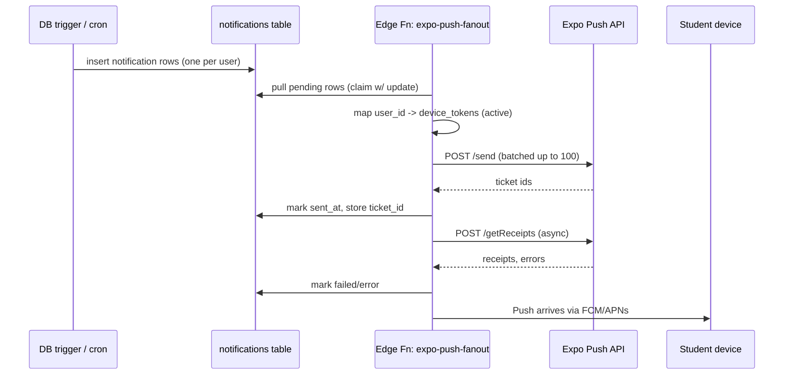

# Phase 08 — Notifications, Analytics, Testing & Launch

## Goal

Close the loop: push notifications that actually fire, product analytics in place, a real test suite, and a launch runbook. This phase turns the MVP into a reliable product we can ship to the client and a pilot batch.

## Why this phase exists

Earlier phases produced features. This phase produces confidence: that the app doesn't crash silently, that notifications are actually delivered, that we can see what students do, and that a regression gets caught before the student does.

## Scope

### In-scope
- Full push notification pipeline: `notifications` row → Edge Function fanout → Expo Push → device.
- Notification categories: class reminders (scheduled), live-started (realtime), new-material, new-recording, attendance-confirmed, payment-success, expiry-reminders, announcements.
- In-app notification inbox + read/unread state.
- Notification preferences (per category opt-out).
- Product analytics (PostHog): event taxonomy, funnels, dashboards.
- Crash reporting verified in prod (Sentry).
- Performance monitoring (Sentry performance + LogRocket-equivalent not included).
- End-to-end test harness (Maestro for RN; Playwright for admin).
- Manual test plan matrix.
- Launch runbook.

### Out-of-scope
- Email marketing.
- WhatsApp-based notifications (can come later — Meta Business API is heavy).
- Deep marketing analytics (attribution, cohorts beyond basic).

## User roles impacted
All.

## Notification strategy

### Recommended approach
**Expo Push Notifications** as the single abstraction in front of **FCM (Android)** and **APNs (iOS)**. Every client platform gets a device token, sends it to our backend, and our Edge Function fans out via Expo Push API.

Why Expo Push over bare FCM/APNs:
- Works out of the box in managed/dev-client Expo.
- One endpoint, one payload format for both platforms.
- Batch API, receipts API, topic-like grouping by token list.
- Free (Expo Go limits don't apply to dev clients / standalone builds).
- We can swap to direct FCM later with small code changes if we ever hit scale.

### Categories and triggers
| Category | Trigger | Audience |
|---|---|---|
| `class.reminder.15m` | pg_cron every minute; 15 min before class scheduled_at | Enrolled active students |
| `class.live.started` | `classes.status` update to `live` | Enrolled active students |
| `recording.ready` | `content_items` insert of type `recording` | Batch students |
| `material.new` | `content_items` insert of type `pdf/image/doc/link` | Batch/course students per visibility |
| `attendance.marked` | `attendance` insert | That student only |
| `payment.success` | `payments.status = paid` | That student only |
| `membership.expiring.7d/3d/1d` | daily cron | That student only |
| `announcement.published` | announcements.published_at set | Target audience |

### Pipeline


### Token hygiene
- On login, RN app registers token via `register_device_token` RPC.
- On logout, delete row.
- On Expo receipt `DeviceNotRegistered`, delete row.
- Re-register on app upgrades (Expo recommends).

## Analytics strategy

**PostHog** (self-host option exists; start with cloud EU region for lowest cost).

### Why PostHog
- Event + user + funnel + retention + session replay in one.
- Cheap at MVP volume.
- RN + Web SDKs.
- Open source — we can move to self-host later.

### Core event taxonomy
- `app_opened`, `login_succeeded`, `login_failed`
- `dashboard_viewed`
- `class_join_tapped`, `class_joined`, `class_left`
- `qr_shown`, `qr_scanned_success`, `qr_scan_failed`
- `recording_play_started`, `recording_play_completed`
- `material_opened`, `material_downloaded`
- `clip_created`, `clip_published`
- `membership_renew_tapped`, `payment_started`, `payment_succeeded`, `payment_failed`
- `notification_tapped`

Each event carries `role`, `batch_id`, `class_id?`, `content_id?` for slicing.

### Dashboards
- Daily active students.
- Live class attendance rate (joined live / eligible).
- Recording watch-through rate (median % watched).
- Material open rate.
- Renewal funnel (tap → checkout open → paid).
- Crash-free session rate (via Sentry + PostHog merge).

## Testing strategy

### Layers
1. **Unit** — Edge Functions (Deno test), schema functions (pgTAP), utilities (Vitest).
2. **Integration** — Supabase end-to-end via `supabase start` in CI; RLS tests with `supabase db test`.
3. **Component** — React Native Testing Library + Storybook; admin with Vitest + @testing-library/react.
4. **E2E mobile** — Maestro flows on a real device (or Android emulator in CI).
5. **E2E web** — Playwright for admin panel critical paths.
6. **Manual** — test matrix covering the demo journeys + edge cases.

### Maestro flows (minimum)
- Login with OTP → dashboard loads.
- View classes → open class detail.
- Show QR → verify rotates.
- Join a live test room → leave after 10s.
- Play a seeded recording → seek + resume.
- Open a PDF.
- Tap Renew → open Razorpay test → success → membership active.

### Playwright flows (minimum)
- Admin login.
- Create student via form; appears in list.
- Upload a PDF; appears in library API.
- Manually mark attendance; reflected in student history.

## Launch runbook

### Pre-launch
- [ ] All acceptance criteria from Phases 1–7 green.
- [ ] Zero P0 Sentry issues in last 7 days on staging.
- [ ] Razorpay switched from test → live with live webhook URL.
- [ ] 100ms live account billing verified.
- [ ] Bunny Stream libraries pointed to prod.
- [ ] Push notification production builds tested on 3 Android devices + 1 iPhone.
- [ ] EAS Update prod channel created.
- [ ] DNS: `app.fynestudy.live` (if web landing), `admin.fynestudy.live`, `api` via Supabase subdomain.
- [ ] Play Store listing draft reviewed; screenshots from real prod.
- [ ] Privacy policy + T&C published.

### Launch day
- [ ] OTA push latest build to pilot batch.
- [ ] Send announcement to pilot students.
- [ ] Monitor Sentry + Supabase logs in real time for 4 hours.
- [ ] Standby for hot-fix OTA.

### Post-launch (first week)
- [ ] Daily 15-min triage: Sentry, PostHog, support queries.
- [ ] Weekly retro with owner.
- [ ] Iterate on top 3 complaints.

## Frontend tasks

- [ ] Notification preferences screen.
- [ ] Notification inbox with unread badges.
- [ ] Deep linking from notification tap (Expo Router config).
- [ ] PostHog SDK integration with user identify on login.
- [ ] Error boundary that reports to Sentry and shows friendly fallback.
- [ ] Analytics event helpers: `track(name, props)` with automatic role/batch attachment.

## Backend tasks

- [ ] `expo-push-fanout` Edge Function: claim-and-send loop, batched, receipt handling.
- [ ] `class-reminders` pg_cron (every minute) — finds classes starting in 15 min + publishes notifications.
- [ ] Triggers on `classes.status`, `content_items`, `attendance`, `payments`, `memberships` (already stubbed in earlier phases; wire up here).
- [ ] Notification preferences table + respected in fanout.
- [ ] Rate limiting on Edge Functions (Supabase per-IP; simple counter for sensitive ones).

## Database / data model needs
```sql
create table notification_preferences (
  user_id uuid primary key references profiles(id) on delete cascade,
  class_reminders boolean default true,
  live_started boolean default true,
  new_content boolean default true,
  attendance boolean default true,
  payments boolean default true,
  announcements boolean default true
);

-- notifications: add ticket_id, error columns
alter table notifications
  add column expo_ticket_id text,
  add column error_code text,
  add column sent_at timestamptz,
  add column read_at timestamptz;
```

## Recommended libraries
| Purpose | Package |
|---|---|
| Push (RN) | `expo-notifications`, `expo-device` |
| Push (server) | `expo-server-sdk` in Edge Function (Deno-compatible fork) |
| Analytics | `posthog-react-native`, `posthog-js` |
| E2E mobile | `maestro` (CLI) |
| E2E web | `@playwright/test` |
| Unit | `vitest`, `deno test`, `pgtap` |

## Edge cases
- User muted notifications in OS → can't fix server-side; we just track + respect.
- iOS "provisional" notifications vs full auth.
- Double-send: idempotency key per (notification_id, device_token).
- Push token expiration → handled via Expo receipts.
- Analytics blocked by privacy settings → graceful degradation.

## Risks
| Risk | Mitigation |
|---|---|
| Expo Push outage | Fanout is retryable; queue holds pending rows; Sentry alert if > 100 pending older than 5 min. |
| PostHog volume costs | Sampling for high-volume events like `dashboard_viewed`. |
| Flaky E2E in CI | Run Maestro/Playwright on a cron, not on every PR; block merge only on unit + integration. |

## Dependencies on earlier phases
- All earlier phases provide the events that trigger notifications and the screens the E2E tests walk through.

## Acceptance criteria
- [ ] Class scheduled for 15 min from now triggers notifications to all enrolled students with a tap-through to class detail.
- [ ] Live class start triggers a push within 30s of `status='live'`.
- [ ] Recording ready triggers a push.
- [ ] User opens a push, lands on the correct screen.
- [ ] Notification preferences respected end-to-end.
- [ ] PostHog shows events with correct user id and role.
- [ ] Sentry shows a release tag with every OTA build.
- [ ] Maestro suite green on CI against a nightly build.

## Definition of done
- All acceptance criteria.
- Launch runbook in `docs/ops/LAUNCH-RUNBOOK.md` executed on staging dry-run.
- Retrospective doc template in `docs/ops/RETRO-TEMPLATE.md`.
- On-call rotation set for first 2 weeks.

## Suggested folder / module breakdown

```
supabase/functions/
├── expo-push-fanout/
├── class-reminders/             # pg_cron driver
└── send-announcement/

apps/mobile/src/
├── lib/
│   ├── push.ts                  # register + handlers
│   ├── analytics.ts             # track() wrapper around PostHog
│   └── sentry.ts
├── features/notifications/
│   ├── InboxScreen.tsx
│   └── PreferencesScreen.tsx

apps/admin/app/(panel)/notifications/
├── logs/
└── templates/
```

## Suggested order of implementation

1. `notification_preferences` table + RLS.
2. `expo-push-fanout` Edge Function with claim-and-send.
3. `class-reminders` pg_cron.
4. Triggers on content/attendance/payment insertions (wire in earlier phases now).
5. RN push registration + deep link handling + inbox + preferences.
6. PostHog integration + event taxonomy.
7. Sentry performance + release tagging.
8. Maestro E2E flows.
9. Playwright admin E2E flows.
10. Launch runbook + on-call doc.
11. Pilot launch with one batch for 2 weeks.
12. Iterate on top feedback.
