# User Flows, Workflows & Sequence Diagrams

This document depicts the critical flows end-to-end. Each one is tied back to a phase in the master plan and is the shared reference when a reviewer asks "how does X actually work?".

## 1. Student login

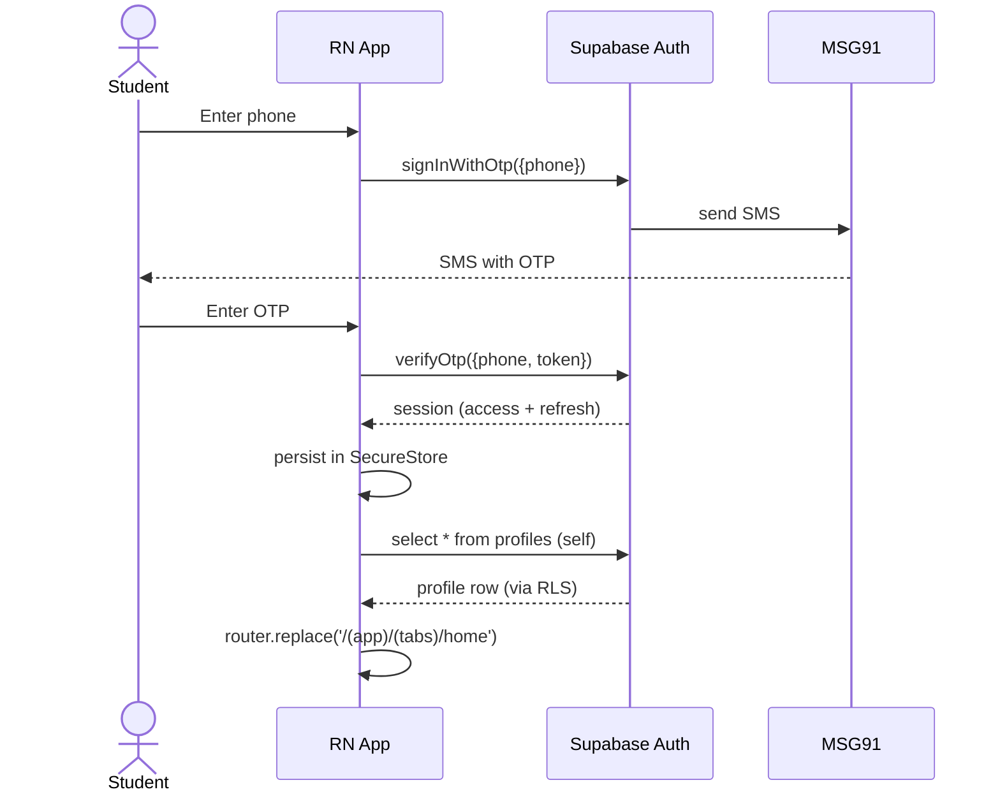

## 2. QR attendance (end-to-end)

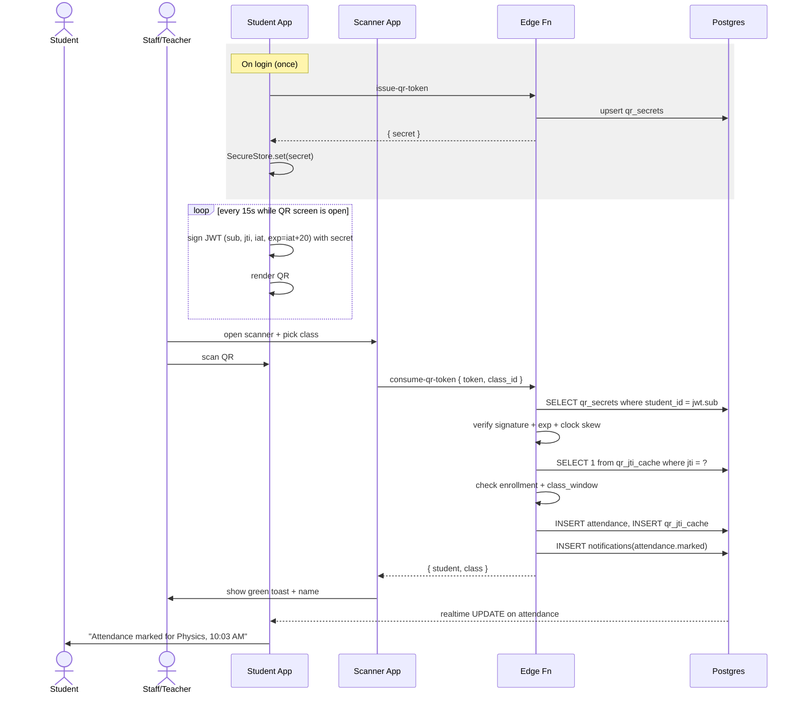

Failure paths shown in `PHASE-03` §Error cases.

## 3. Live class join

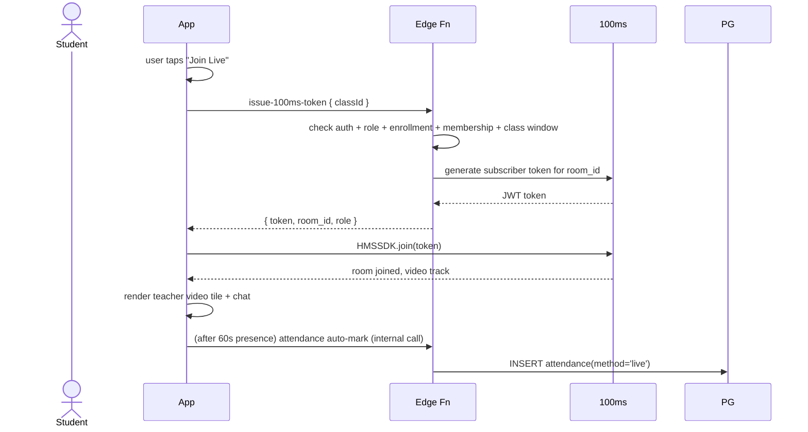

## 4. Class end + recording availability

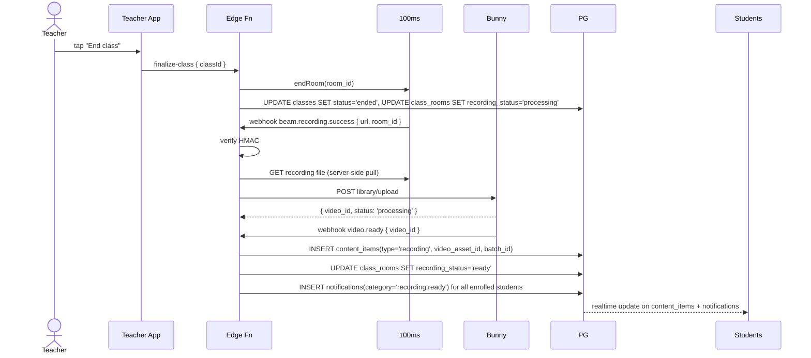

## 5. Recorded-class playback

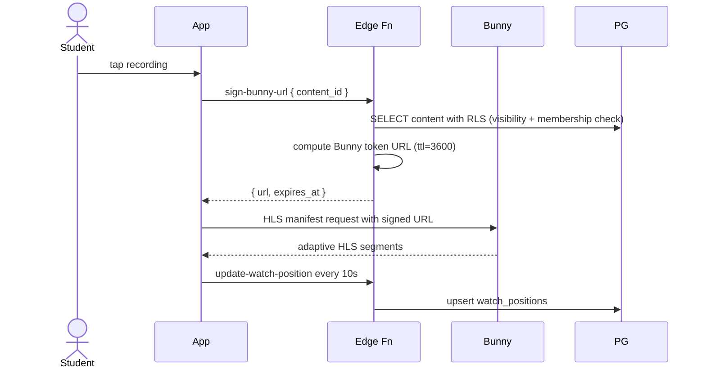

## 6. Study material upload & access

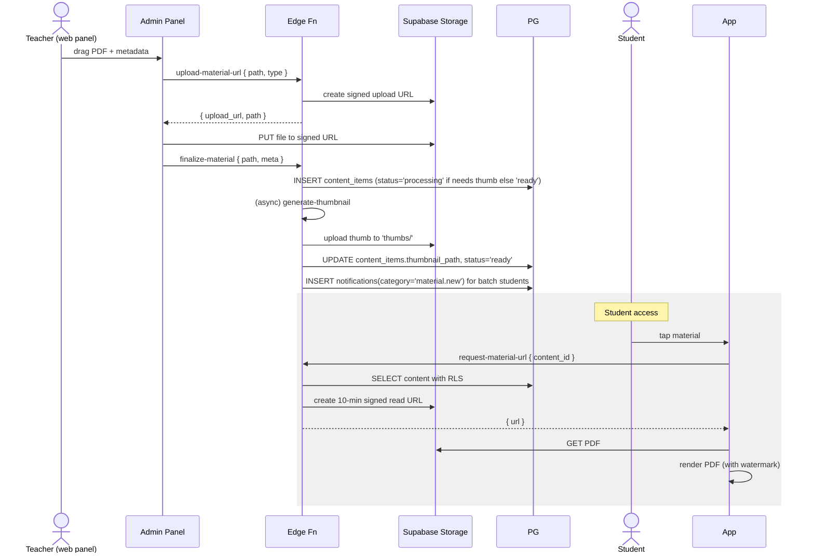

## 7. Membership payment and activation

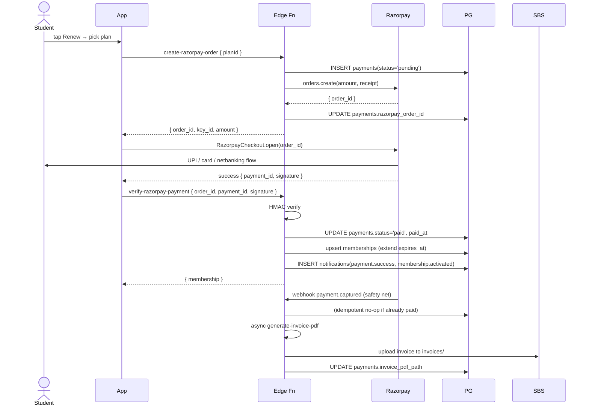

## 8. Teacher clip creation

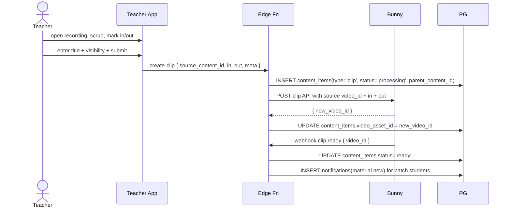

## 9. Admin adds a student

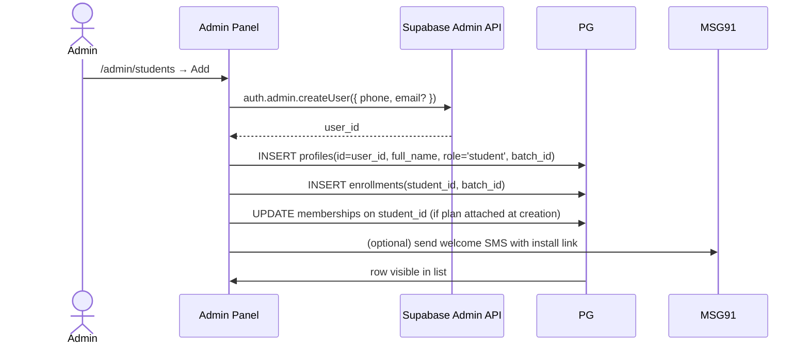

## 10. Admin moderation of teacher upload

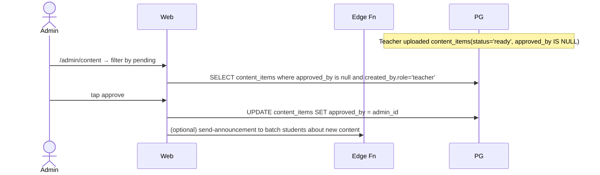

## 11. Push notification reminder pipeline

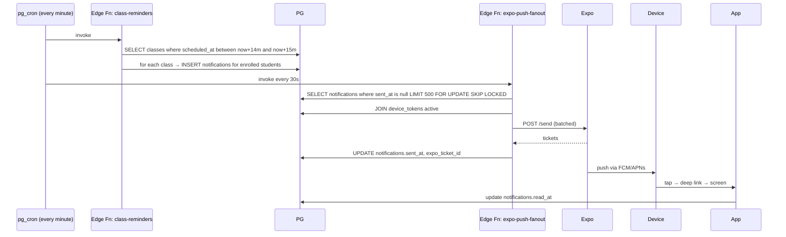

## 12. Teacher starts a live class

```mermaid
sequenceDiagram
    actor T as Teacher
    participant TApp as Teacher App
    participant EF as Edge Fn
    participant HMS as 100ms
    participant PG

    T->>TApp: tap "Start class" (only enabled ≤10 min before scheduled_at)
    TApp->>EF: create-100ms-room { classId }
    EF->>EF: idempotency: exists class_rooms row? else:
    EF->>HMS: create room (name = class_id)
    EF->>PG: INSERT class_rooms(provider_room_id)
    EF->>EF: start recording via 100ms beam
    EF->>PG: UPDATE classes SET status='live'; UPDATE class_rooms SET recording_status='recording'
    EF->>PG: INSERT notifications(category='class.live.started') for batch students
    EF-->>TApp: { room_id, host_token }
    TApp->>HMS: join as host
    PG-->>Students: realtime classes UPDATE → dashboard flips to "Live now"
```

## 13. Student opens QR while offline

```mermaid
sequenceDiagram
    actor S as Student
    participant App
    participant SS as SecureStore

    S->>App: open QR screen
    App->>SS: getSecret(student_id)
    alt cached
      SS-->>App: secret
      App->>App: sign JWT locally; render QR
      Note over App: Works offline; scanner still needs network
    else missing
      App->>EF: issue-qr-token (requires network)
      Note over App: If offline AND no cached secret → show "Connect to internet once"
    end
```

## 14. Membership expiry flip

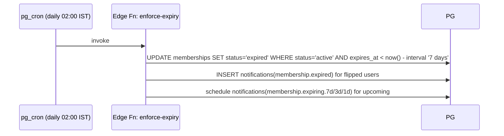

## 15. End-to-end demo day walkthrough

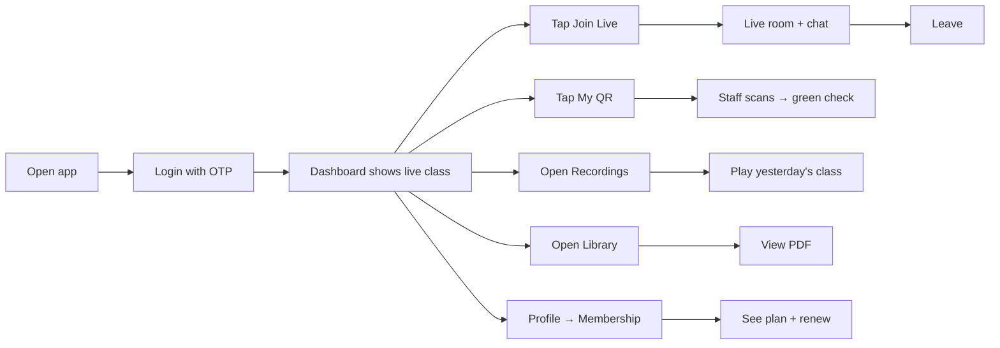

## 16. Error handling flow (generic)

```mermaid
flowchart TD
  A[User action] --> B{Network?}
  B -- No --> B1[Show offline banner + retry]
  B -- Yes --> C[Call API]
  C --> D{Response}
  D -- 401 --> D1[Force logout + go to phone]
  D -- 403 --> D2[Show "Access denied"]
  D -- 422 --> D3[Show business error code message]
  D -- 429 --> D4[Show "Too many attempts, try in 60s"]
  D -- 5xx --> D5[Sentry capture + show retry toast]
  D -- 200 --> E[Update cache / navigate]
```
